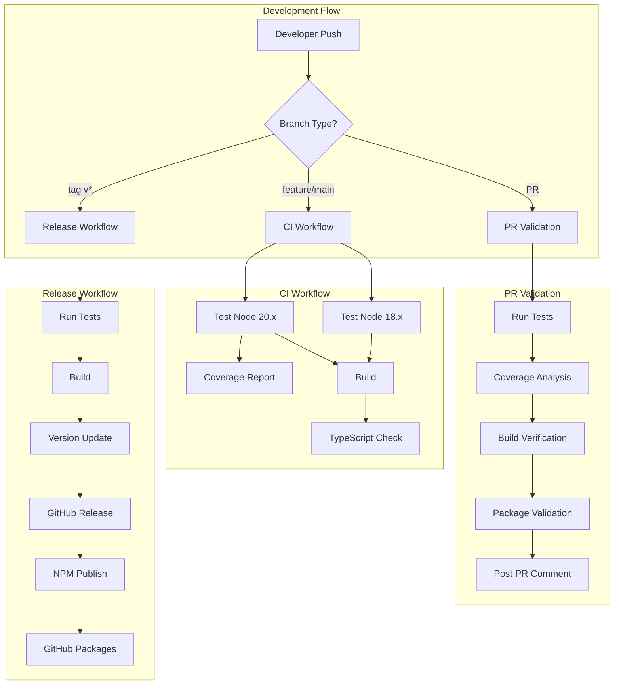
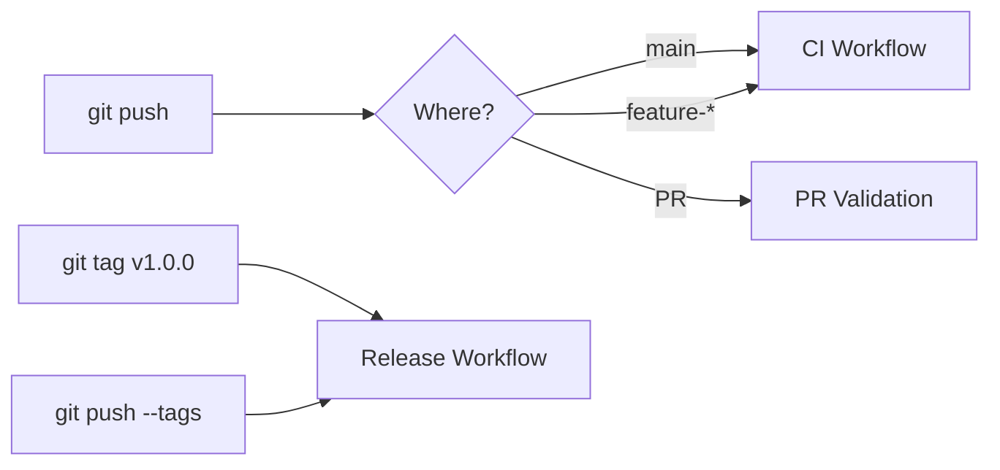

# CI/CD Pipeline Documentation

## Overview

This project uses GitHub Actions for continuous integration and deployment. The pipeline ensures code quality, automates testing, and streamlines the release process.

## Pipeline Architecture



## Workflows

### 1. Continuous Integration (CI)

**File:** `.github/workflows/ci.yml`  
**Triggers:** Push to `main` or `feature-*` branches, Pull requests to `main`


#### Features:
- **Matrix Testing**: Tests on Node.js 18.x and 20.x
- **Coverage Reporting**: Displays test coverage in logs
- **Build Verification**: Ensures all artifacts are created
- **TypeScript Validation**: Checks for type errors

#### Configuration:
```yaml
strategy:
  matrix:
    node-version: [18.x, 20.x]
```

### 2. Pull Request Validation

**File:** `.github/workflows/pr-validation.yml`  
**Triggers:** PR opened, synchronized, or reopened


#### Features:
- **Comprehensive Testing**: Full test suite execution
- **Coverage Analysis**: Calculates and reports coverage percentages
- **Build Validation**: Verifies successful compilation
- **Automated Feedback**: Posts validation results as PR comment

#### PR Comment Format:
```markdown
## PR Validation Results

### ✅ Validation Passed
- Tests: All tests passing
- Build: Successfully built all artifacts
- Package: Valid package.json structure

### 📊 Code Coverage
- Statements: 88.75%
- Branches: 88.02%
- Functions: 83.54%
- Lines: 88.69%
```

### 3. Automated Code Review

**File:** `.github/workflows/code-review.yml`  
**Triggers:** PR opened or synchronized with code changes


#### Features:
- **ESLint Analysis**: Checks for code quality issues
- **Security Scanning**: Detects hardcoded secrets and vulnerabilities
- **Complexity Analysis**: Reports on code complexity metrics
- **Automated Comments**: Posts detailed review feedback
- **Label Management**: Adds review status labels
- **Copilot Integration**: Information about AI-powered reviews

### 4. Release Workflow

**File:** `.github/workflows/release.yml`  
**Triggers:** Push tags matching `v*` or manual workflow dispatch


#### Features:
- **Version Management**: Automatic version extraction from tags
- **Dual Publishing**: Publishes to both NPM and GitHub Packages
- **Pre-release Support**: Beta versions with `-` in version number
- **GitHub Release Creation**: Automatic release notes generation

## Configuration Requirements

### 1. Repository Secrets


| Secret | Required | Description | How to Obtain |
|--------|----------|-------------|---------------|
| `NPM_TOKEN` | Yes (for releases) | NPM authentication token | `npm token create` |
| `GITHUB_TOKEN` | Auto-provided | GitHub authentication | Automatically available |

### 2. Setting Up NPM Token

```bash
# 1. Login to NPM
npm login

# 2. Create token
npm token create

# 3. Copy the token
# 4. Go to GitHub repo settings
# 5. Navigate to Secrets → Actions
# 6. Add new secret named NPM_TOKEN
```

### 3. Branch Protection Rules

Recommended settings for `main` branch:


## Usage Guide

### Running Workflows

#### 1. Automatic Triggers



#### 2. Manual Release

1. Go to Actions tab
2. Select "Release" workflow
3. Click "Run workflow"
4. Enter version (e.g., `1.0.0`)
5. Click "Run workflow" button

### Testing Locally

```bash
# Install act (GitHub Actions runner)
brew install act  # macOS
# or
curl https://raw.githubusercontent.com/nektos/act/master/install.sh | sudo bash

# Test workflows locally
act push                # Test CI workflow
act pull_request       # Test PR workflow
act workflow_dispatch  # Test manual triggers
```

## Coverage Reporting

### Coverage Thresholds

Current project coverage:


| Metric | Coverage | Target |
|--------|----------|--------|
| Statements | 88.75% | >85% |
| Branches | 88.02% | >80% |
| Functions | 83.54% | >80% |
| Lines | 88.69% | >85% |

### Coverage Reports Location

- **Local**: `./coverage/lcov-report/index.html`
- **CI Logs**: Available in GitHub Actions run logs
- **PR Comments**: Automatically posted on pull requests

## Troubleshooting

### Common Issues

#### 1. NPM Publish Fails

**Error:** `npm ERR! 401 Unauthorized`

**Solution:**
```bash
# Regenerate NPM token
npm token create

# Update GitHub secret
# Settings → Secrets → Actions → NPM_TOKEN → Update
```

#### 2. Coverage Report Missing

**Error:** Coverage not showing in logs

**Solution:**
```bash
# Ensure test:ci script includes coverage
npm run test:ci  # Should run: jest --coverage --watchAll=false
```

#### 3. Build Artifacts Not Found

**Error:** `test: dist/servers/persona.js: No such file`

**Solution:**
```bash
# Ensure build runs before verification
npm run build
# Check tsconfig.json outDir setting
```

## Maintenance

### Updating Node Versions

Edit `.github/workflows/ci.yml`:

```yaml
strategy:
  matrix:
    node-version: [18.x, 20.x, 22.x]  # Add new versions
```

### Adding New Checks

Add to PR validation workflow:

```yaml
- name: New Check
  run: |
    echo "Running new validation"
    npm run your-new-script
```

### Modifying Release Process

Edit `.github/workflows/release.yml` to add pre/post release steps:

```yaml
- name: Pre-release Hook
  run: npm run prerelease
  
# ... existing release steps ...

- name: Post-release Hook
  run: npm run postrelease
```

## Best Practices

1. **Commit Messages**: Use conventional commits for better release notes
   ```
   feat: add new feature
   fix: resolve bug
   docs: update documentation
   chore: maintenance tasks
   ```

2. **Version Tags**: Follow semantic versioning
   ```
   v1.0.0     # Major release
   v1.1.0     # Minor release
   v1.1.1     # Patch release
   v1.2.0-beta.1  # Pre-release
   ```

3. **PR Workflow**: 
   ```mermaid
   graph LR
       A[Feature Branch] --> B[Create PR]
       B --> C[Automated Checks]
       C --> D[Code Review]
       D --> E[Merge to Main]
       E --> F[CI Runs]
       F --> G[Ready for Release]
   ```

## GitHub Copilot Integration

### Enabling Copilot for Pull Requests

1. **Repository Settings**:
   - Go to Settings → GitHub Copilot
   - Enable "Copilot for Pull Requests"

2. **Copilot Features**:
   - **Automatic PR Reviews**: AI-powered code suggestions
   - **Security Scanning**: Identifies potential vulnerabilities
   - **Code Quality**: Suggests improvements and best practices
   - **Documentation**: Recommends missing documentation

3. **Copilot Comments**:
   ```markdown
   Copilot will automatically comment on:
   - Code smells and anti-patterns
   - Performance optimizations
   - Security vulnerabilities
   - Missing error handling
   - Suggested refactoring
   ```

### AI Review Workflow


## Security Considerations

1. **Never commit secrets** to the repository
2. **Use GitHub Secrets** for sensitive data
3. **Limit token permissions** to minimum required
4. **Rotate tokens regularly** (every 90 days recommended)
5. **Review workflow permissions** in repository settings
6. **Enable Copilot security scanning** for vulnerability detection

## Resources

- [GitHub Actions Documentation](https://docs.github.com/en/actions)
- [NPM Publishing Guide](https://docs.npmjs.com/cli/v8/commands/npm-publish)
- [Semantic Versioning](https://semver.org/)
- [Conventional Commits](https://www.conventionalcommits.org/)